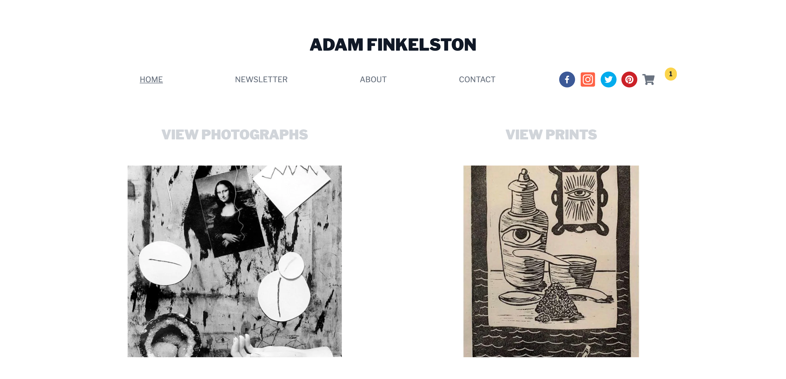

# Sanity.io and Next.js Ecommerce Starter

This is the official website for Adam Finkelston, artist, publisher, and educator based in Prairie Village, KS. He has shown his art work in solo exhibitions in Kansas City, MO as well as group and juried exhibitions throughout the United States and internationally. Mr. Finkelston is also the owner, publisher and co-editor of the quarterly photography and printmaking magazine, [The Hand Magazine: A Magazine For Reproduction-based Art](https://thehandmagazine.com/).

Check the live version [here](adamfinkelston.vercel.app/) ⚡️

This site uses [Next.js](https://nextjs.org), [Sanity](https://sanity.io), [TailwindCSS](https://tailwindcss.com), [Mailchimp](https://mailchimp.com), and [Stripe](https://stripe.com).

**Features:**

* Live previews, including website preview for products
* Frontend with product pages styled using Tailwind.css
* Content types for products, ads, pages, routes, popup shops, social media

## Credits

The e-commerce frontend is built with Tailwind components by [khatabwedaa](https://tailwindcomponents.com/u/khatabwedaa).
Design and development of the site was done with help by [Imran Sayed](https://imranhsayed.medium.com/adding-mailchimp-subscribe-newsletter-in-next-js-react-application-7c776daae710) blog on adding Mailchimp, and from [Sanity's own guide on integrating Stripe](https://www.sanity.io/guides/building-ecommerce-sites-with-the-stripe-api).

## Found

This site can be found [here](adamfinkelston.vercel.app) 
